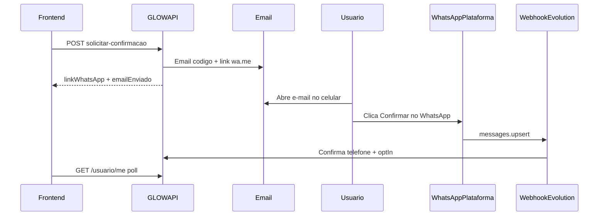

# Confirmacao WhatsApp

Fluxo **e-mail + inbound**: ao solicitar confirmacao, a API envia um **e-mail** com codigo e link `wa.me` para o WhatsApp da plataforma. O usuario envia a mensagem; o webhook confirma e libera alertas.

**Regra geral:** alertas so sao enfileirados quando o telefone foi **confirmado** (`whatsAppConfirmado`) e o usuario/negocio aceitou alertas (`whatsAppOptIn`).

| Perfil | Telefone confirmado | E-mail(s) destino |
|--------|---------------------|-------------------|
| Cliente / profissional | `Usuario.Telefone` | `Usuario.Email` |
| Estabelecimento | `Estabelecimento.Telefone` | Conta logada + e-mail comercial (deduplicados) |

**Pre-requisito:** conta ativa (e-mail de cadastro confirmado) e telefone no perfil.

---

## Fluxo principal



1. Cadastre o telefone no perfil.
2. Chame `solicitar-confirmacao` — a API envia e-mail e retorna instrucoes.
3. No celular, abra o e-mail e toque em **Confirmar no WhatsApp** (link `wa.me` com mensagem `GLOW {codigo}` pre-preenchida).
4. Envie a mensagem **do numero cadastrado no perfil**.
5. O webhook confirma automaticamente (`whatsAppOptIn = true`).

---

## Cliente — campos no perfil

`GET /api/usuario/me`:

```json
{
  "telefone": "11988887777",
  "whatsAppConfirmado": true,
  "whatsAppOptIn": true,
  "whatsAppPendenteConfirmacao": false
}
```

---

## Cliente — solicitar confirmacao

`POST /api/usuario/me/whatsapp/solicitar-confirmacao`

**Headers:** `x-glow-token`

**200:**

```json
{
  "message": "Verifique seu e-mail para confirmar o WhatsApp.",
  "data": {
    "numeroPlataforma": "5511999999999",
    "codigoConfirmacao": "482913",
    "mensagemSugerida": "GLOW 482913",
    "linkWhatsApp": "https://wa.me/5511999999999?text=GLOW%20482913",
    "emailEnviado": true,
    "expiraEm": "2026-05-31T12:00:00Z"
  }
}
```

Dispara e-mail automaticamente ao alterar `telefone` em `PUT /api/usuario/me`.

---

## Estabelecimento — solicitar confirmacao

`POST /api/estabelecimentos/{estabelecimentoId}/whatsapp/solicitar-confirmacao`

**Headers:** `x-glow-token` + permissao `NegocioEditar`

Envia e-mail para:
- e-mail da conta logada; e
- e-mail comercial do estabelecimento (`Estabelecimento.Email`), se diferente.

Mesmo formato de resposta do cliente.

---

## Profissional e equipe

Mesmo fluxo do cliente via `Usuario.Email` e `Usuario.Telefone`.

Profissional autonomo: ao mudar telefone, sincroniza `Usuario` + telefone comercial e dispara e-mails correspondentes.

---

## Reenviar instrucoes por e-mail

`POST /api/auth/reenviar-confirmacao-whatsapp` (sem auth)

```json
{
  "email": "maria@email.com"
}
```

**200:** resposta generica (nao revela se o e-mail existe ou ja foi confirmado).

---

## Webhook Evolution API

Configure na instancia Evolution (webhook por evento):

| Evento Evolution | Metodo | Rota (sem auth) |
|------------------|--------|-----------------|
| `MESSAGES_UPSERT` | POST | `/api/webhooks/whatsapp/evolution/messages-upsert` |
| `SEND_MESSAGE` | POST | `/api/webhooks/whatsapp/evolution/send-message` |

Exemplo staging:

```text
MESSAGES_UPSERT → https://api-staging-61ce.up.railway.app/api/webhooks/whatsapp/evolution/messages-upsert
SEND_MESSAGE    → https://api-staging-61ce.up.railway.app/api/webhooks/whatsapp/evolution/send-message
```

- `messages-upsert`: confirma codigo WhatsApp inbound (inclui `fromMe: true`, ex.: mesmo chip plataforma/perfil em staging)
- `send-message`: recebido e registrado em log (sem efeito colateral hoje)

### Respostas automaticas ao usuario (WhatsApp)

Quando a mensagem contem `GLOW` (tentativa de confirmacao), a API enfileira:

| Momento | Canal | Mensagem |
|---------|-------|----------|
| Ao receber | WhatsApp | Estamos processando sua confirmacao |
| Sucesso | WhatsApp | Confirmacao aprovada |
| Ja confirmado | WhatsApp | Seu WhatsApp ja esta confirmado |
| Falha (codigo/telefone) | WhatsApp + e-mail (se houver) | Nao conseguimos confirmar seu numero |

---

## Fallback manual (opcional)

- `POST /api/auth/confirmar-whatsapp` com `{ codigo, telefone }`
- `POST /api/estabelecimentos/{id}/whatsapp/confirmar` com `{ codigo }`

Preferir sempre e-mail + link wa.me em producao.

---

## Opt-in / opt-out

Apos confirmacao inbound, `whatsAppOptIn` vem `true`. Para desativar alertas:

`POST /api/usuario/me/whatsapp/opt-in` ou `POST /api/estabelecimentos/{id}/whatsapp/opt-in`

```json
{ "optIn": false }
```

---

## Alertas de agendamento

| Destinatario | Condicao |
|--------------|----------|
| Cliente | `Usuario.PodeReceberAlertasWhatsApp()` |
| Telefone comercial | `Estabelecimento.PodeReceberAlertasWhatsApp()` |
| Profissional | `Profissional.Usuario.PodeReceberAlertasWhatsApp()` |

Eventos: agendamento **confirmado**, **cancelado** ou **remarcado**.

---

## Configuracao backend (Railway)

| Variavel | Exemplo |
|----------|---------|
| `Mensageria__WhatsApp__ApiUrl` | URL Evolution API |
| `Mensageria__WhatsApp__ApiKey` | chave da instancia |
| `Mensageria__WhatsApp__InstanceName` | `glow-staging` |
| `Mensageria__WhatsApp__NumeroPlataforma` | `5511999999999` |
| `Mensageria__WhatsApp__WebhookApiKey` | validacao do webhook |
| `Mensageria__WhatsApp__Habilitado` | `true` |
| `Mensageria__Email__Habilitado` | `true` (envio real de e-mail) |

Em dev com e-mail desabilitado, use `linkWhatsApp` da resposta JSON para testar manualmente.

---

## Troubleshooting webhook (staging)

**HTTP 200 no `messages-upsert` nao garante confirmacao.** O endpoint sempre responde 200 apos processar o payload; `whatsAppConfirmado` so muda quando telefone + codigo batem com um usuario/estabelecimento pendente.

### Logs esperados no Railway

| Log | Significado |
|-----|-------------|
| `payload bruto Evolution` | JSON completo enviado pela Evolution (truncado em 8k chars) |
| `messages-upsert recebido` | Request chegou ao service; inclui `RemoteJid`, `EhLid`, `SenderInstancia` (numero da instancia Evolution, **nao** o cliente), `MotivoTelefoneVazio` |
| `messages-upsert ignorado: nao inbound` | Payload sem `data`, sem telefone extraivel e sem `GLOW` no texto (`Motivo=sem_campo_data` / `telefone_nao_extraido`) |
| `messages-upsert ignorado: mensagem sem GLOW` | Self-chat ou chat comum sem tentativa de confirmacao — nenhuma resposta automatica |
| `WhatsApp confirmado via webhook inbound` | Confirmacao gravada com sucesso |
| `Motivo=EntidadeNaoEncontrada` | Telefone do webhook nao bate com perfil pendente |
| `Motivo=CodigoInvalido` | Mensagem sem o codigo atual (`GLOW {codigo}`) |
| `Motivo=SemPendencia` | Nao ha solicitacao de confirmacao ativa |
| `Motivo=JaConfirmado` | WhatsApp ja estava confirmado |
| `sem telefone ou texto` | Parser nao extraiu `remoteJid`/mensagem do payload Evolution |
| `apikey invalida` | `Mensageria__WhatsApp__WebhookApiKey` nao confere com payload |

### Causas comuns

1. **Codigo antigo** — cada `solicitar-confirmacao` gera codigo novo; use sempre o ultimo e-mail.
2. **Telefone diferente do perfil** — a mensagem deve sair do numero cadastrado em `Usuario.Telefone` (equivalencia BR com/sem 9o digito e aceita).
3. **Payload `@lid` e `sender` da instancia** — no staging Evolution v1.7, `data.key.remoteJid` as vezes vem como `@lid` **sem** `remoteJidAlt`/`senderPn`. O campo root `sender` e o **numero conectado na instancia** (chip da plataforma), **nao** o telefone de quem mandou a mensagem — a API **ignora** `sender` quando `fromMe=false`. Nesse cenario a confirmacao inbound funciona **somente pelo codigo** (`GLOW {codigo}`); as respostas automaticas (`processando`, `sucesso`) vao sempre para o **telefone cadastrado do dono do codigo**, mesmo que o payload traga outro numero. Mitigacao infra: atualizar Evolution/WhatsApp Web ou `WPP_LID_MODE=false`. Fallback manual: `POST /api/auth/confirmar-whatsapp`.
4. **Self-chat sem `GLOW`** — mensagens como `"mande dnv o codigo"` ou figurinhas no proprio numero da instancia sao ignoradas (sem `ja confirmado` nem outras respostas automaticas).
### Isolar parser vs regra de negocio

Se o webhook retorna 200 mas o status continua pendente, teste o fallback manual:

```http
POST /api/auth/confirmar-whatsapp
Content-Type: application/json

{
  "telefone": "79991917634",
  "codigo": "123456"
}
```

- Se o fallback confirmar: problema estava no payload Evolution (telefone/texto).
- Se o fallback falhar: codigo expirado, telefone errado ou sem pendencia no banco.

---

## Checklist frontend

- [ ] Tela "Verifique seu e-mail" apos solicitar confirmacao
- [ ] Exibir `linkWhatsApp` como atalho secundario (deep link)
- [ ] Poll `GET /api/usuario/me` ate `whatsAppConfirmado = true`
- [ ] Toggle opt-in apos confirmacao
- [ ] Tratar expiracao (reenviar via e-mail)
